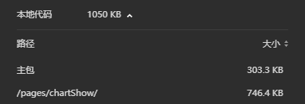

#### 官方仓库和网上资源基本都跑不起来,干脆自己整理

1. 微信小程序使用echarts
2. 分包独立出echart,不占用主包内容

#### 命令 
    npm run weapp //打包
    
    node fixRequire.js //单独处理ec-canvas.js文件

#### 效果

#### 预览地址

#### tarojs版本 3.0+ 使用经测试没有问题

1. config/index.js 修改

    几个路径一定要确认是正确的,分包的模块需要放在对应的目录下

        const EchartChunk = 'pages/chartShow/echarts';

        const config = {
            ...
            outputRoot: `dist/${process.env.TARO_ENV}`,
            ...
            mini:{
                ...
                   webpackChain (chain, webpack) {
                      chain.merge({
                        optimization: {
                          splitChunks: {
                            cacheGroups: {
                              [EchartChunk]: {
                                name: EchartChunk,
                                priority: 50,
                                test(module) {
                                  return /pages[\\/]chartShow[\\/]components[\\/]ec-canvas[\\/]echarts.js/.test(module.resource);
                                }
                              }
                            }
                          }
                        }
                      });
                    },
                    addChunkPages (pages, pagesNames) {
                      pages.set('pages/chartShow/index', [EchartChunk]);
                    },
                
                ...
            }
        }

2. 增加了fixRequire.js 文件,目的是增加原生组件的引入
    
    package.json 修改

        ...
            "scripts": {
                ...
                "weapp": "npm run build:weapp && node fixRequire.js",
                ...
            }
        ...

    fixRequire.js 修改文件地址改为自己项目的地址即可
        
        
